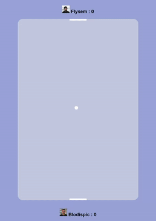
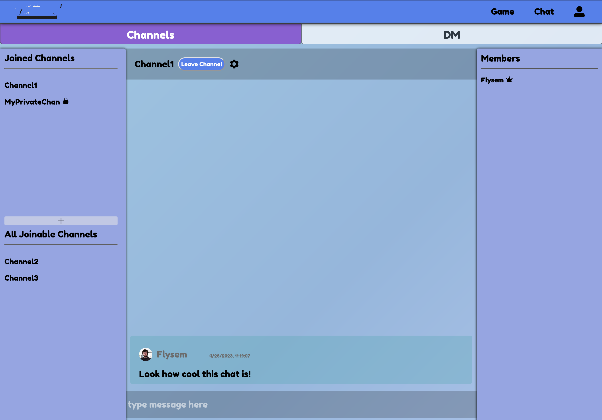

<a name="readme-top"></a>

[![Contributors][contributors-shield]][contributors-url]
[![Forks][forks-shield]][forks-url]
[![Stargazers][stars-shield]][stars-url]
[![Issues][issues-shield]][issues-url]


<!-- PROJECT LOGO -->
<br />
<div align="center">
  <a href="https://github.com/github_username/repo_name">
    
  </a>

<h3 align="center">Transcendance</h3>

  <p align="center">
    Transcendance is a website designed to play a custom game of pong with people online.
    <br />
    <a href="https://github.com/Blodispic/transcendance"><strong>Explore the docs »</strong></a>
    <br />
    <br />
    <a href="https://github.com/Blodispic/transcendance/issues">Report Bug</a>
    ·
    <a href="https://github.com/Blodispic/transcendance/issues">Request Feature</a>
  </p>
</div>


<!-- TABLE OF CONTENTS -->
<details>
  <summary>Table of Contents</summary>
  <ol>
    <li>
      <a href="#about-the-project">About The Project</a>
      <ul>
        <li><a href="#built-with">Built With</a></li>
      </ul>
    </li>
    <li>
      <a href="#getting-started">Getting Started</a>
      <ul>
        <li><a href="#how-to-install">How to install</a></li>
      </ul>
    </li>
    <li><a href="#usage">Usage</a></li>
    <li><a href="#contributing">Contributing</a></li>
    <li><a href="#contact">Contact</a></li>
  </ol>
</details>


<!-- ABOUT THE PROJECT -->
## About The Project

[![Product Name Screen Shot][product-screenshot]](https://example.com)

This project is about creating a website for the mighty Pong contest!

Users will be able to play Pong with others with a nice user
interface and a chat!


<p align="right">(<a href="#readme-top">Back to top</a>)</p>


### Built With

* [![Next][Next.js]][Next-url]
* [![React][React.js]][React-url]

<p align="right">(<a href="#readme-top">Back to top</a>)</p>


<!-- GETTING STARTED -->
## Getting Started

This is an example of how you may give instructions on setting up your project locally.
To get a local copy up and running follow these simple example steps.


### How to install
Be aware that as it stands, you can only connect to transcendance using 42API, which means adding your IP adress in the API from your 42 account.
Start by add a .env file following the template below:
```
#URL
APP_BACK=http://10.11.8.2:4000/
FRONT_URL=http://10.11.8.2:3000

#42API
API42_UID=ExempleAPI
API42_SECRET=ExempleSecret
REDIRECT_URI=http://10.11.8.2:3000/

#PostGres
POSTGRES_HOST=PostgreSQL
POSTGRES_PORT=5432
POSTGRES_USER=DB_Username
POSTGRES_PASSWORD=DB_Password

#JWT
JWT_SECRET=secretKey

#TWO_FA
TWO_FACTOR_NAME=Trandancense
```

Install Docker, and launch the project with:
```
docker-compose up --build
```

<p align="right">(<a href="#readme-top">Back to top</a>)</p>


<!-- USAGE EXAMPLES -->
## Usage

The game is played as shown below.
You can move around with the arrow keys, pressing both at the same time makes you go up.




You can also chat with other players, using the chat page shown below.



<p align="right">(<a href="#readme-top">Back to top</a>)</p>

<!-- CONTRIBUTING -->
## Contributing

Contributions are what make the open source community such an amazing place to learn, inspire, and create. Any contributions you make are **greatly appreciated**.

If you have a suggestion that would make this better, please fork the repo and create a pull request. You can also simply open an issue with the tag "enhancement".
Don't forget to give the project a star! Thanks again!

1. Fork the Project
2. Create your Feature Branch (`git checkout -b feature/AmazingFeature`)
3. Commit your Changes (`git commit -m 'Add some AmazingFeature'`)
4. Push to the Branch (`git push origin feature/AmazingFeature`)
5. Open a Pull Request

<p align="right">(<a href="#readme-top">Back to top</a>)</p>

<!-- CONTACT -->
## Contact

Project Link: [https://github.com/Blodispic/transcendance](https://github.com/Blodispic/transcendance)

<p align="right">(<a href="#readme-top">Back to top</a>)</p>


<!-- MARKDOWN LINKS & IMAGES -->
<!-- https://www.markdownguide.org/basic-syntax/#reference-style-links -->
[contributors-shield]: https://img.shields.io/github/contributors/Blodispic/transcendance.svg?style=for-the-badge
[contributors-url]: https://github.com/Blodispic/transcendance/graphs/contributors
[forks-shield]: https://img.shields.io/github/forks/Blodispic/transcendance.svg?style=for-the-badge
[forks-url]: https://github.com/Blodispic/transcendance/network/members
[stars-shield]: https://img.shields.io/github/stars/Blodispic/transcendance.svg?style=for-the-badge
[stars-url]: https://github.com/Blodispic/transcendance/stargazers
[issues-shield]: https://img.shields.io/github/issues/Blodispic/transcendance.svg?style=for-the-badge
[issues-url]: https://github.com/Blodispic/transcendance/issues
[product-screenshot]: images/homepage.png
[Next.js]: https://img.shields.io/badge/next.js-000000?style=for-the-badge&logo=nextdotjs&logoColor=white
[Next-url]: https://nextjs.org/
[React.js]: https://img.shields.io/badge/React-20232A?style=for-the-badge&logo=react&logoColor=61DAFB
[React-url]: https://reactjs.org/
[Vue.js]: https://img.shields.io/badge/Vue.js-35495E?style=for-the-badge&logo=vuedotjs&logoColor=4FC08D
[Vue-url]: https://vuejs.org/
[Angular.io]: https://img.shields.io/badge/Angular-DD0031?style=for-the-badge&logo=angular&logoColor=white
[Angular-url]: https://angular.io/
[Svelte.dev]: https://img.shields.io/badge/Svelte-4A4A55?style=for-the-badge&logo=svelte&logoColor=FF3E00
[Svelte-url]: https://svelte.dev/
[Laravel.com]: https://img.shields.io/badge/Laravel-FF2D20?style=for-the-badge&logo=laravel&logoColor=white
[Laravel-url]: https://laravel.com
[Bootstrap.com]: https://img.shields.io/badge/Bootstrap-563D7C?style=for-the-badge&logo=bootstrap&logoColor=white
[Bootstrap-url]: https://getbootstrap.com
[JQuery.com]: https://img.shields.io/badge/jQuery-0769AD?style=for-the-badge&logo=jquery&logoColor=white
[JQuery-url]: https://jquery.com 
